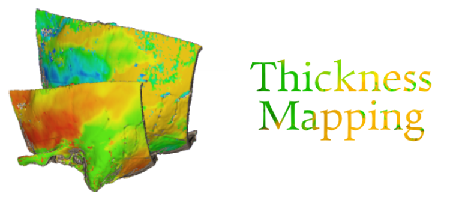

  
   
  <b style='font-size: 40px;'>3D Slicer Module</b>
   
  <i>Developed by HML & SKA Auditory Medical Biophysics Lab at Western University, London, ON, CA</i>

## About
A [3D Slicer](https://www.slicer.org/) extension capable of rendering a clinical bone scan in 3D with an overlayed gradient colour map depicting the bone-thickness.

## Algorithm Procedure
1. Convert input volume to Slicer segmentation
2. Threshold, smooth, and apply island-removal on segmentation
3. Cast a grid of rays in one direction to collect the points representing the surface of the bone
4. Iterate through the retrieved surface mesh, casting a ray through the bone segmentation perpendicular to the bone surface
5. Calculate thickness using bone intersection points
6. Render thickness map with a gradient map on the surface of the bone model

## Screenshot

## Installation
1. Download repository project folder
2. Open 3D Slicer and navigate to the module 'Extension Wizard' (Modules>Developer Tools>Extension Wizard)
3. Click 'Select Extension'
4. Navigate to the repository project folder
5. The module will now be accessible via Modules>Shape Analysis>Thickness Mapping

## Basic Tutorial 
1. In 3D-Slicer, navigate to the **Sample Data** module
2. Select the "CBCTDentalSurgery" data set (Slicer will then download and import this set)

3. Open the **Bone Thickness Mapping** module via **Modules>Shape Analysis>Thickness Mapping**

4. Using the input volume selector, select either the PreDentalSurgery or PostDentalSurgery volume

5. Expand the configuration panel and input the following:
> Otsu threshold range: MIN of 611.0, MAX of 4000.0  
> Cast direction: 'A'  
> (optional) Render quality: 'High'  
Note: A valid otsu threshold range is required for accurate depth mapping. Sufficient ranges can be found using the 3D Slicer Segmentation Editor's thresholding tool.

6. Click the 'Execute' button. Once completed the following result should be displayed:

